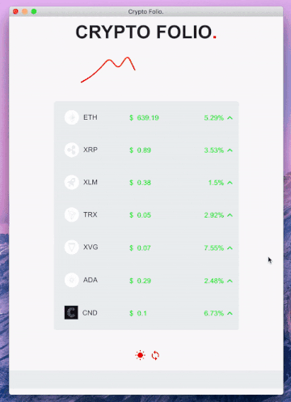

# CryptoFolio

Virtual crypto wallet to see value of your crypto currencies.

[https://hamzapixl.github.io/crypto-folio/](https://hamzapixl.github.io/crypto-folio/) 
  
## Demo

  
    
  ***
  
## Install 

  ### Clone the repository
  ``git clone https://github.com/hamzaPixl/crypto-folio.git``

  ### Install differents packages
  ``npm i``

## Start 

  ### Start the electron app
  ``npm start``

## Config your Wallet

  > Before starting it go to `src/config/wallet/` and remove files correspondig to crypto that you don't want to track. If you want to add a new crypto for traking you have to create a new file corresponding to your crypto.

  ### Example
  
  > You want to track the crypto **Stellar**
  
  ### Logo
  
  > For some style you have to add a logo for you cryptocurrency. Add the file in `src/assets/icons/coins/xlm.svg`
  
  > We support different type of logo but **SVG** is better.
  
  ### Information
  
  > Add a file named `src/config/wallet/xlm.js` or whatever you want. The content is something like this. when **XXX** is how   much you hold in this cryptocurrency.
  
  > All keys are required.
  
  > Add the file into `src/config/wallet/index.js` and export it.
  
  ```javascript
  import React from 'react';

  import XLM from '../../assets/icons/coins/xlm.svg';

  const coin = {
    hodl: XXX,
    name: 'Stellar',
    symbol: 'XLM',
    icon: ,
    link: 'https://api.coinmarketcap.com/v1/ticker/stellar/',
  };

  export default coin;
  ```

  
  ```javascript
  import xlm from './xlm';

  const coins = [xlm];

  export default coins;
  ```
  
  ***
  
  
# Author

Hamza Mounir - hamza.pixelle@gmail.com    
[Linkedin](https://www.linkedin.com/in/hamza-mounir-0a7bb6139/)   
[Github](https://github.com/hamzaPixl)    
